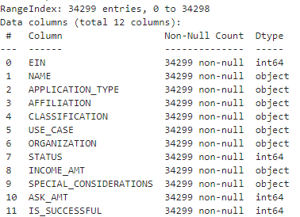
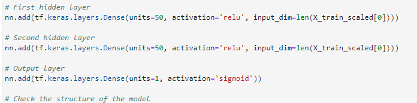
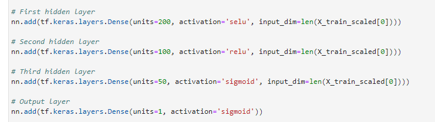
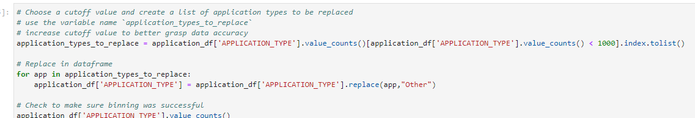
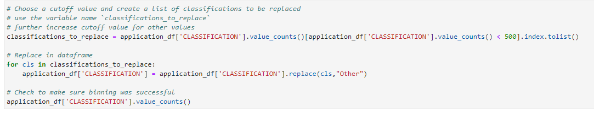
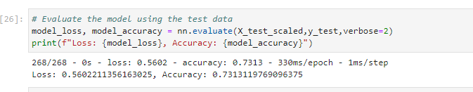

# deep-learning-challenge

## Background Information
The nonprofit foundation Alphabet Soup wants a tool that can help it select the applicants for funding with the best chance of success in their ventures. 
This project uses neural network model to create a binary classifier that can predict whether applicants will be successful if funded by Alphabet Soup.

## Summary Report

### Overview of the Analysis
* This analysis is to create a neural network model which can predict whether applicants will succeed if funded by Alphabet Soup (Google).

* The dataset contains 34,299 instances and 12 features, the features includes:
* 

* The analysis is conducted in the following stages:
  * First set up the neural network model. We set up the initial model as follow:

  *

  * Next we review the data, and decide whether we need to improve and how to improve the model further such as advancing to this step of the model:
  
  *

### Results
* Data Preprocessing
  - What variable(s) are the target(s) for your model?
    - The target is `IS_SUCCESSFUL`.
  - What variable(s) are the features for your model?
    - The features are `STATUS`, `ASK_AMT`, `APPLICATION_TYPE`, `AFFILIATION`, `CLASSIFICATION`, `USE_CASE`, `ORGANIZATION`, `INCOME_AMT`, `SPECIAL_CONSIDERATIONS`.
  - What variable(s) should be removed from the input data because they are neither targets nor features?
    - `EIN` and `NAME` are removed.
* Compiling, Training, and Evaluating the Model
  - How many neurons, layers, and activation functions did you select for your neural network model, and why?
    - The first layer has 200 neurons with `selu` as activation function, SELUs learn faster and better than other activation functions without needing further procession, this enables our model to have speed, and learn better.
    - The second layer has 100 neurons with `relu` as activation function, Relu is better than sigmoid here, simply because it is a better activation function most of the time.
    - The third layer has 50 neurons with `sigmoid` as activation function, to attempt to further increase the accuracy of the model.
    - The output layer has 1 neuron with `sigmoid` as activation function, because we want a single output and it should be 0 or 1.
  - Were you able to achieve the target model performance?
    - No.
  - What steps did you take in your attempts to increase model performance?
    - Increased the cutoff for the bins for Application type
    -  
    - Increased the cutoff for the bins for Classification
    -    
    - Took steps to improve the nerual network by increasing neurons, layers, and varying activation types.
  
### Summary

* My best attempt is the third optimization where we have an accuracy of 73.13%.
* A Support Vector Machine model may be better to solve the problem. Since SVMs perform far better with small to medium-sized datasets.

* 

## File Paths

- Code for initial model: AlphabetSoupCharity.ipynb
- Code for Optimize 1: AlphabetSoupCharity_Optimization_attempt1.ipynb
- Code for Optimize 2: AlphabetSoupCharity_Optimization_attempt2.ipynb
- Code for Optimize 3: AlphabetSoupCharity_Optimization_attempt3.ipynb

## References & Data Source

1. Data Source: data for this dataset was generated/provided by edX Boot Camps LLC, and is intended for educational purposes only.
